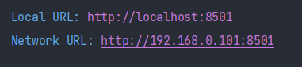

# Custom Object Tracker

_Tracks object which is selected my the cursor._

##**Steps:**

1. Run `streamlit run detect_your_choice_with_streamlit.py` 
2. Open any of the following link in your browser this will open the Streamlit web app 
   
   
3. Select a ROI and then press SPACE or ENTER button.
